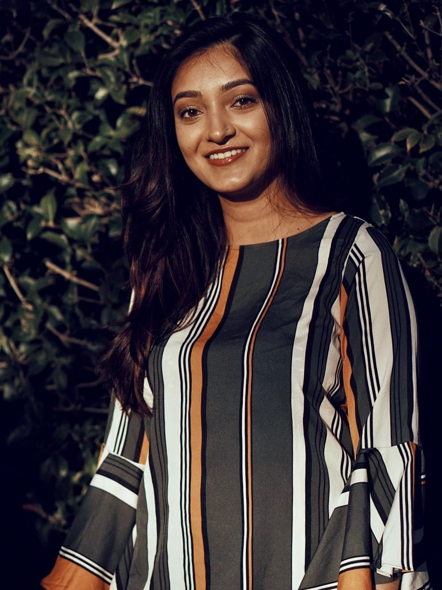

  
  
&nbsp;

<html>
<head>
<meta name="viewport" content="width=device-width, initial-scale=1">

</head>
<body>

  

  
  

  

  
Hello! My name is Jaisal Amin and I’m a second-year Master’s student in Biostatistics at Columbia University. In addition to being a full-time student, I am also currently a teaching assistant and research intern at NYU Langone Health. Prior to coming to Columbia, I studied at North Carolina State University and worked in various research roles.

I am interested in using data and sound statistical methods to solve real-world problems. Outside the classroom, I enjoy perfecting my piano-playing skills and spending quality time with friends and family.

I keep this site updated with my latest projects and information, please feel free to check out my work or contact me with any inquiries!  
  
  

</body>
</html>

          

### Check out some of my projects [here](projects.html).

### You can learn more about me [here](about.html).
  

## Thanks for visiting!

