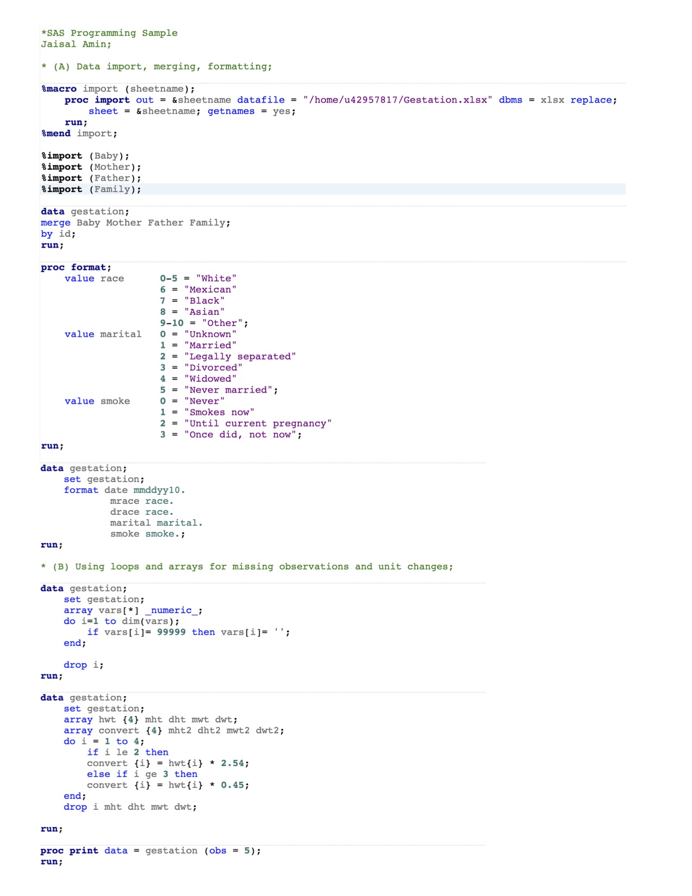
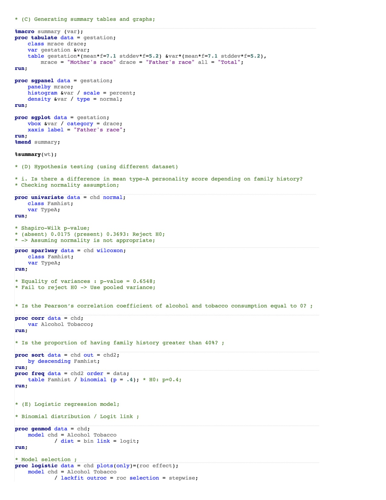

```{r setup, include=FALSE}
knitr::opts_chunk$set(echo = TRUE)

library(SASmarkdown)
```

```{sas}
/* (A) Data import, merging, formatting; */

%macro import (sheetname);
	proc import out = &sheetname datafile = "./Gestation.xlsx" dbms = xlsx replace;
		sheet = &sheetname; getnames = yes;
	run;
%mend import;

%import (Baby);
%import (Mother);
%import (Father);
%import (Family);

data gestation;
merge Baby Mother Father Family;
by id;
run;

proc format;
	value race		0-5 = "White"
					6 = "Mexican"
					7 = "Black"
					8 = "Asian"
					9-10 = "Other";
	value marital	0 = "Unknown"
					1 = "Married"
					2 = "Legally separated"
					3 = "Divorced"
					4 = "Widowed"
					5 = "Never married";
	value smoke		0 = "Never"
					1 = "Smokes now"
					2 = "Until current pregnancy"
					3 = "Once did, not now";
run;

data gestation;
	set gestation;
	format date mmddyy10.
			mrace race.
			drace race.
			marital marital.
			smoke smoke.;
run;
```
/* (B) Using loops and arrays for missing observations and unit changes; */

data gestation; 
	set gestation;
	array vars[*] _numeric_; 
	do i=1 to dim(vars); 
		if vars[i]= 99999 then vars[i]= ''; 
	end; 

	drop i; 
run;

data gestation;
	set gestation;
	array hwt {4} mht dht mwt dwt;
	array convert {4} mht2 dht2 mwt2 dwt2;
	do i = 1 to 4;
		if i le 2 then
		convert {i} = hwt{i} * 2.54;
		else if i ge 3 then
		convert {i} = hwt{i} * 0.45;
	end;
	drop i mht dht mwt dwt;
	
run;

proc print data = gestation (obs = 5);
run;

* (C) Generating summary tables and graphs;

%macro summary (var);
proc tabulate data = gestation;
	class mrace drace;
	var gestation &var;
	table gestation*(mean*f=7.1 stddev*f=5.2) &var*(mean*f=7.1 stddev*f=5.2),
		mrace = "Mother's race" drace = "Father's race" all = "Total";
run;

proc sgpanel data = gestation;
	panelby mrace;
	histogram &var / scale = percent;
	density &var / type = normal;
run;

proc sgplot data = gestation;
	vbox &var / category = drace;
	xaxis label = "Father's race";
run;
%mend summary;

%summary(wt);

* (D) Hypothesis testing (using different dataset)

* i. Is there a difference in mean type-A personality score depending on family history?
* Checking normality assumption;

proc univariate data = chd normal;
	class Famhist;
	var TypeA;
run;

* Shapiro-Wilk p-value;
* (absent) 0.0175 (present) 0.3693: Reject H0;
* -> Assuming normality is not appropriate;

proc npar1way data = chd wilcoxon;
	class Famhist;
	var TypeA;
run;

* Equality of variances : p-value = 0.6548;
* Fail to reject H0 -> Use pooled variance;


* Is the Pearson’s correlation coefficient of alcohol and tobacco consumption equal to 0? ;

proc corr data = chd;
	var Alcohol Tobacco;
run;

* Is the proportion of having family history greater than 40%? ;

proc sort data = chd out = chd2; 
	by descending Famhist; 
run;
proc freq data = chd2 order = data;
	table Famhist / binomial (p = .4); * H0: p=0.4;
run;


* (E) Logistic regression model;

/* Binomial distribution / Logit link ;

proc genmod data = chd;
	model chd = Alcohol Tobacco
			/ dist = bin link = logit;
run;

/* Model selection ; */
proc logistic data = chd plots(only)=(roc effect);
	model chd = Alcohol Tobacco 
			/ lackfit outroc = roc selection = stepwise;
run;

proc logistic data = chd plots(only)=(roc effect);
	model chd (event = "Case") = Tobacco / lackfit outroc = roc;
run;

```


<html>




</html>